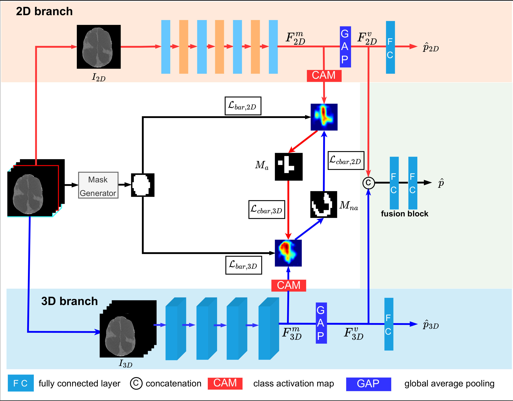
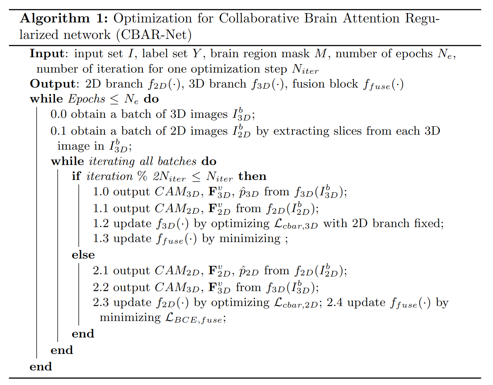

# CT_infection_diagnosis

# Collaborative brain attention regularized network
This repository contains clarification and implementation details of collaborative brain attention regularized network (CBAR-Net) in the paper ''Infection Diagnosis in Hydrocephalus CT Images: A Domain Enriched Attention Learning Approach'' (submitted to NeuroImage Clinic).

# Details of collaborative brain attention regularized network
The overal architecture of CBAR-Net is illustrated in the figure above. The CBAR-Net consists of a 2D branch, 3D branch and a fusion block.
## 2D branch
The backbone of the 2D branch is a DenseNet, which is composed of a 2D convolution layer, 4 2D dense blocks, 3 convolution block attention modules (CBAM), and 3 transition blocks. Each dense block comprises of several densely connected convolutional layers, a rectified linear unit (ReLU) activation, and a batch normalization layer. Finally,  feature vectors are fed to a fully connected layer for classification. The CAMs are generated by computing the weighted average of feature maps $F^m$ using the fully connected layer's parameters as the weights. 

## 3D branch 
The 3D branch consists of four 3D dense blocks, three 3D transition blocks followed by a global average pooling, a fully connected layer, and a Softmax layer. The 3D dense blocks and 3D transition blocks are similar in structure to those in the 2D branch with the 2D convolution layer, 2D batch normalization and 2D pooling operations replaced by its 3D counterparts. The 3D branch has the same number of layers as the 2D branch in order to ensure that they have the same receptive field in the activation maps.
## Fusion block
Other than probability scores output from final classifier, 2D and 3D branch will output feature maps $\textbf{F}^m_{2D}$ and $\textbf{F}^m_{3D}$ respectively, which would be used for generating class activation maps and feature fusion.

The input to the fusion block is a feature vector $\textbf{F}^v$ which is a concatenation of $\textbf{F}^v_{2D}$ and $\textbf{F}^v_{3D}$. Both are generated via global averaging pooling (GAP) of feature maps $\textbf{F}^m_{2D}, \textbf{F}^m_{3D}$ from 2D and 3D branches. The steps for generating $\textbf{F}^v$ are
$$\textbf{F}^v = concatenate(\textbf{F}^v_{2D}, \textbf{F}^v_{3D})$$
$$\textbf{F}^v_{2D} = GAP(\textbf{F}^m_{2D}),\quad \textbf{F}^v_{3D} = GAP(\textbf{F}^m_{3D})$$
where
$$GAP(\textbf{F}^m) = \frac{1}{H \times W}\sum_i\sum_j \textbf{F}^m(:,\ i,\ j)$$
and $\textbf{F}^m$ is the set of feature maps in shape of $C\times H \times W$.

The loss function for fusion block is binary cross-entropy:
$$\mathcal{L}_{BCE, fuse}(y, \hat{\textbf{p}}) = - ylog(\hat{\textbf{p}}) - (1 - y)log(1 - \hat{\textbf{p}})$$

## Training strategy

### Collaborative brain attention regularizer for 2D branch:
In this step, the 3D branch is considered as the teacher model, which informs the 2D branch about the non-activated regions. First, a non-activation mask $M_{na}$ is generated, which yields a higher value (close to 1) in the 3D branch's class non-activation region and a lower value (close to 0) in the class activation region. 
$$M_{na}(i, j) = 1 - \frac{1}{1 + exp(-w_{3D}\cdot A_{3D}^{c}(i, j))}$$
where $M_{na}(i, j)$ is the pixel in the non-activation mask at position $(i,j)$, $A_{3D}^{c}$ is the activation map of class $c$ from the 3D branch, and $w_{3D}$ is the weight controlling the slope of the gating function.

Then, the activated regions in the 2D branch that are not activated in the 3D branch are suppressed by the following loss term:
$$L_{cbar, 2D} = \||M_{na}^{\texttt{fix}} \odot A_{2D}\||_1$$

where $A_{2D}$ is CAM from 2D branch, and $M_{na}^{\texttt{fix}}$ is the fixed non-activation mask which will not be changed when this equation is being minimized.

By minimizing this term, the non-activated regions in the 3D branch suppress the 2D branch's class activation maps thereby enforcing the network to pay less attention on that region while the other regions remain unaffected. Therefore, the 2D branch is informed of the non-activated regions in the 3D branch.

### Collaborative brain attention regularizer for 3D branch:

Alternatively, the 2D branch will act as the teacher model in this step and informs the 3D branch of the activation region. First, an activation mask $M_a$ is generated, which yields a higher value (close to 1) in the 2D branch's class activation region and a lower value (close to 0) in its class non-activation region.
$$M_{a}(i, j) = \frac{1}{1 + exp(-w_{2D}\cdot A_{2D}^{c}(i, j))}$$

where $A_{2D}^{c}$ is the activation map of the ground truth class $c$ of the 2D branch and $w_{2D}$ is the parameter controlling the slope of the function Eqn. (\ref{eqn:m_a}). A larger positive value of $w_{2D}$ will make the output of the masking function change rapidly around the threshold.
The 3D branch's class activation level in the 2D branch's class activation region is represented as:
$$L_{cbar, 3D} = - \||M_{a}^{\texttt{fix}}  \odot A_{3D}\||_1$$

where $A_{3D}$ is CAM from 3D branch. By minimizing this term, the 3D branch will pay more attention in the 2D branch's activated region while the other region remains unaffected. 

In addition, the brain attention regularizer is applied so that the model pays more attention inside the brain region. The loss terms $L_{bar, 2D}$ and $L_{bar, 3D}$, ensure that meaningful information is shared between the 2 branches and the activation maps generated are likely to be more interpretable to the clinicians. The $L_{bar, 3D}$ is defined as
$$L_{bar, 3D} = \||\prod\limits_{k=1}^{16}(1 - M_k) \odot A_{3D}\||_1$$
where $M_k$ is brain mask of the $k^{th}$ slice.

The 2D and 3D branches are alternatively trained and their loss functions are defined as:
$$L_{2D} = L_{BCE} + \alpha_1 L_{cbar,2D} + \alpha_2 L_{bar,2D}$$
$$L_{3D} = L_{BCE} + \alpha_3 L_{cbar,3D} + \alpha_4 L_{bar,3D}$$
where the $\alpha_i$'s are hyper-parameters that control the influence of the regularization term's on the training procedure. 
### Training strategy:
Optimization of 2D branch and 3D branch are conducted alternatively. At each optimization step, one branch is fixed and provide information for the other branch. The details of optimization steps are illustrated in algorithm below.

### Codes
`main_2d3d.py`: main file used for training the model

`model_2d3d.py`: python file where CBAR-Net is constructed

`dataset_2d3d.py`: torch.nn.dataset file for generating batches from dataset, which include augmentation process.

`loss.py`: file containing losses functions

`util.py`: utility files containing several standard functions
